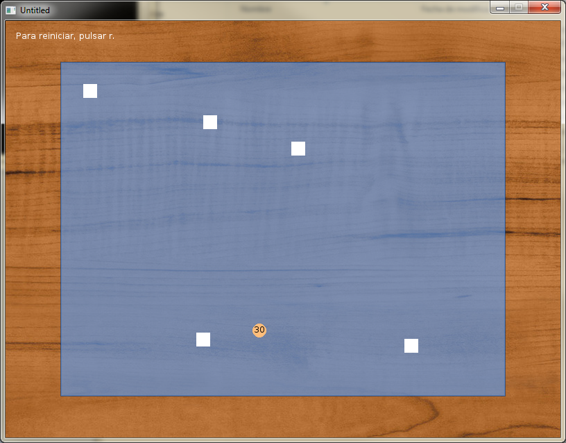

Fish Tank
=============================

I programmed this little simulation with specifications that were given to me on Artificial Intelligence subject. The specifications where originally made for a program in CLIPS, which we studied in class.

Controls
-----------------------------------------------------
The functioning is really simple: Just watch the fishes die. 

Each rectangle is a fish. The circle is food (the number saying how many units are left). The AI of each fish will try to survive by reaching the food in time. The black console will tell you what the fishes are doing, or if they die.

How to execute it
-----------------------------------------------------
Just download the .zip and execute the .exe :D

License
-----------------------------------------------------
"Fish Tank" is subjected to the LPGL v3 license.
